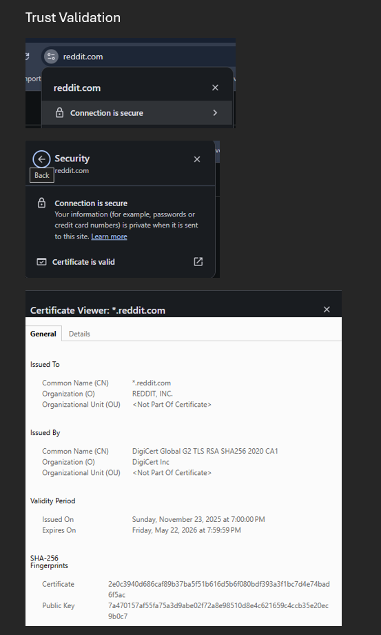

# Week 01 Lab — Certificate Inspection

## Screenshot Evidence

1. Capture a screenshot of the certificate details in your browser.
2. Save it as:

assets/screenshots/week-01/certificate-inspection.png

3. Embed the screenshot below:

## Website Information

**Website inspected:**  
www.reddit.com

**Issuer (Certificate Authority):**  
- CN = DigiCert Global G2 TLS RSA SHA256 2020 CA1  
- O = DigiCert Inc  
- C = US

**Valid from:**  
11/23/25, 7:00:00 PM EST

**Valid until:**  
5/22/26, 7:59:59 PM EDT

**Signature algorithm:**  
PKCS #1 SHA-256 With RSA Encryption

---

## Subject Alternative Names (SAN Entries)

- DNS Name: *.reddit.com  
- DNS Name: reddit.com  
- Not Critical  

---

## Observations

### Observation 1
The certificate is valid for a short period of time. In enterprise environments, I am used to seeing certificates extend to 2–3 years.  

### Observation 2
The certificate uses **RSA with SHA‑256**, which is a strong, widely accepted encryption method.  

### Observation 3
The way the certificate appears in the browser depends on the browser type and operating system. Browsers show certificates as a view, not as a full path or chain by default.

---

## Reflection

This certificate helps make HTTPS secure by proving that connections to www.reddit.com are actually served by Reddit and not an imposter (hence the “S” after HTTP).  
The browser looks at the certificate and checks the signature made by the issuer (DigiCert) to make sure the website really belongs to Reddit.  
Certificates like this let the browser **encrypt information**, keep user data safe from hackers, and make sure messages aren’t changed while they are sent.
(2–3 sentences)
