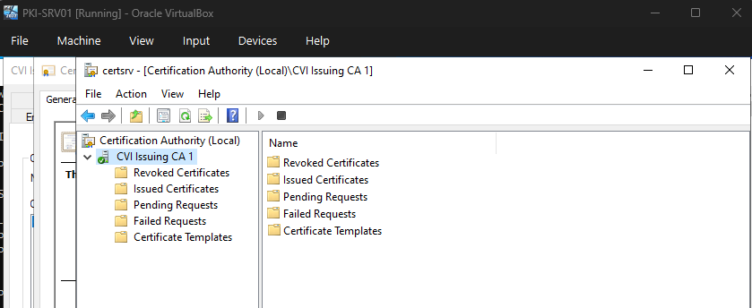

# Lab 01: Environment Verification & VM Connectivity Check

**Student Name: Nyaisa Deverger**  
**Date Completed:** 05/04/2026  
**Phase:** 2 | **Week:** 9  
**Submission Path:** `labs/week-09/lab-01-environment-verification.md`

---

## Step 1 – VM Startup & Login

**VMs started in correct order (DC01 → PKI-SRV01 → Root-CA):**
- [x] Yes
- [ ] No — describe what happened:

**Login credentials used:**

| VM | Account Used | Login Successful? |
|----|-------------|-------------------|
| DC01 | CORP\pki.admin | Yes |
| PKI-SRV01 | CORP\pki.admin | Yes |
| Root-CA | .\Administrator | Yes |

**Notes / issues encountered:**

```
No issues. All three VMs started successfully in the required order and login was confirmed on each.
```

---

## Step 2 – VM Connectivity Test

**Command run on PKI-SRV01:**

```powershell
Test-Connection -ComputerName DC01 -Count 2
```

**Output received:**

```
Source        Destination     IPV4Address      IPV6Address                              Bytes    Time
                                                                                                 (ms)
------        -----------     -----------      -----------                              -----    ----
PKI-SRV01     DC01            192.168.10.10                                             32       1
PKI-SRV01     DC01            192.168.10.10                                             32       11

```

**DC01 responded successfully:**
- [x] Yes
- [ ] No — troubleshooting steps taken:

---

## Step 3 – CertSvc Service Status

**Command run on PKI-SRV01:**

```powershell
Get-Service -Name CertSvc
```

**Output received:**

```
Status   Name               DisplayName
------   ----               -----------
Running  CertSvc            Active Directory Certificate Services
```

**CertSvc status shown:** Running

**Service was Running:**
- [x] Yes
- [ ] No — action taken:

---

## Step 4 – Certification Authority Console

**Steps completed on PKI-SRV01:**
- [x] Opened certsrv.msc via Run dialog
- [x] Confirmed CA name visible: CVI Issuing CA 1

- [x] Confirmed CA status: Valid - 4/25/2026-/4/25/2027
- [x] Expanded left pane — folders visible (Revoked Certificates, Issued Certificates, etc.)

**Screenshot or description of what you observed in certsrv.msc:**



---

## Step 5 – Certificate Log File Path

**Command run on PKI-SRV01:**

```powershell
Get-ChildItem "C:\Windows\System32\CertLog"
```

**Output received:**

```

    Directory: C:\Windows\System32\CertLog


Mode                 LastWriteTime         Length Name
----                 -------------         ------ ----
-a----          5/4/2026   8:38 AM        1048576 CVI Issuing CA 1.edb
-a----          5/4/2026   8:38 AM          16384 CVI Issuing CA 1.jfm
-a----          5/4/2026   8:38 AM           8192 edb.chk
-a----          5/4/2026   8:39 AM        1048576 edb.log
-a----         4/25/2026   7:45 PM        1048576 edbres00001.jrs
-a----         4/25/2026   7:45 PM        1048576 edbres00002.jrs
-a----         4/25/2026   7:45 PM        1048576 edbtmp.log
-a----          5/4/2026   8:38 AM          20480 tmp.edb

```

**Files found in CertLog:**

| File Name | Approximate Size |
|-----------|-----------------|
| CVI Issuing CA 1.edb | 1,048,576 bytes (1 MB) |
| CVI Issuing CA 1.jfm | 16,384 bytes (16 KB) |
| edb.chk | 8,192 bytes (8 KB) |
| edb.log | 1,048,576 bytes (1 MB) |
| edbres00001.jrs | 1,048,576 bytes (1 MB) |
| edbres00002.jrs | 1,048,576 bytes (1 MB) |
| edbtmp.log | 1,048,576 bytes (1 MB) |
| tmp.edb | 20,480 bytes (20 KB) |

---

## Reflection

**One thing that went well during this lab:**

```
The lab instructions were clear and well-structured. All three VMs started without issues, network
connectivity between PKI-SRV01 and DC01 was confirmed quickly, and the CertSvc service was already
running, which allowed me to proceed through each step without delays.
```

**One thing that was confusing or unexpected:**

```
When running Get-ChildItem against the CertLog directory, I received an "Access to the path is denied"
error. I had not initially opened PowerShell with elevated privileges. Re-launching PowerShell as
Administrator resolved the issue. This was a good reminder that certificate service directories
require administrative access, which makes sense given the sensitive data they contain.
```

---

## Submission Checklist

- [x] All five steps completed
- [x] All command outputs pasted
- [x] Reflection section filled in
- [x] File saved as `lab-01-environment-verification.md`
- [x] File committed to my portfolio repo under `labs/week-09/`