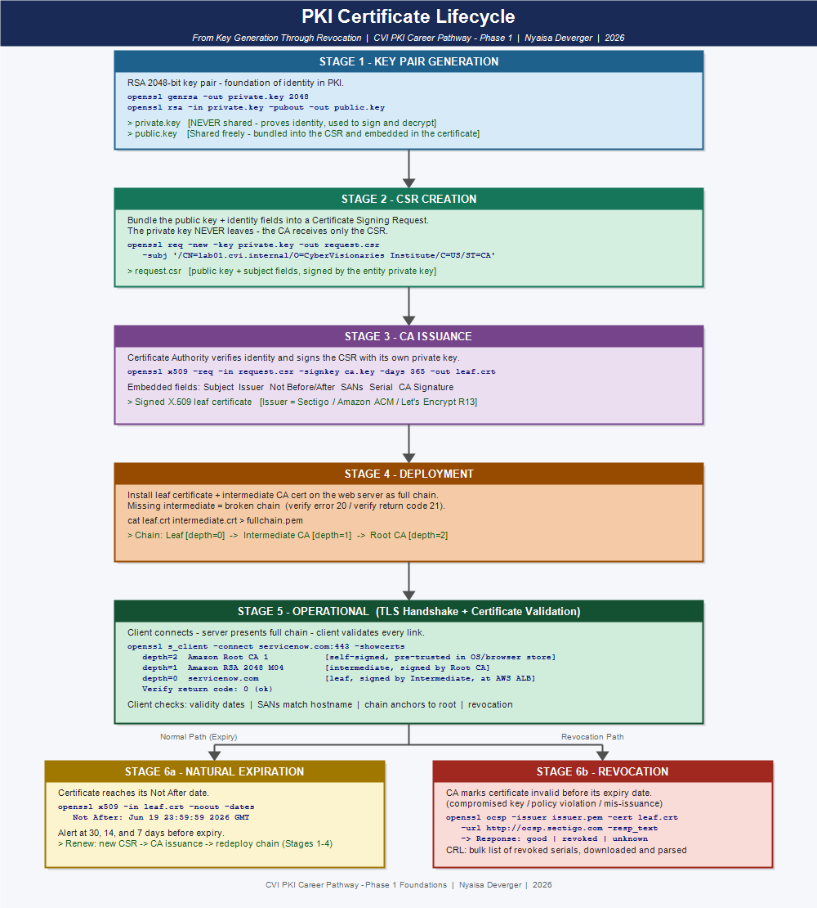

# Phase 1 Reflection Project

Submit this in your portfolio repository:
`reflections/phase1-reflection.md`

Include your visual in:
`reflections/visual/phase1-diagram.[png | pdf | jpg]`

---

## Before You Begin

Review all of your weekly reflections (`reflections/week-01.md` through `reflections/week-07.md`) before writing this.
Your final submission should build on those entries — not repeat them.

Choose your submission format:
- [x] Written reflection (500–800 words)

**Video link (if applicable):** N/A

---

## Part 1 — Your Phase 1 Journey

*How has your understanding of PKI changed from Week 1 to now? What did you think PKI was before you started? What was the first thing that genuinely surprised you?*

Before this phase, I thought PKI was essentially just the padlock icon in a browser — something that happened automatically in the background whenever you visited a secure website. I understood at a surface level that HTTPS meant the connection was encrypted, but I had no real picture of what was doing the work underneath. I knew my role at work involved SANS certificate renewals, but I was performing steps in a process I couldn't fully explain.

The first thing that genuinely surprised me was realizing that trust is not a setting — it's a mathematical chain. When I first tried to verify a certificate chain in Week 3 and got `verification failed`, my instinct was that something was broken with the certificate itself. What I discovered was that the problem was the trust store. The certificate was perfectly valid; my environment just didn't have the right root CA to anchor the chain to. That moment flipped my mental model. Trust isn't assumed, it's computed — and every step in the chain has to resolve correctly for it to work.

By Week 7, I was pulling the full certificate chain from servicenow.com, reading CT logs on crt.sh, and identifying from the issuer alone that TLS had to terminate at an AWS load balancer rather than the Apache server. That's a completely different level of understanding than where I started. I went from "PKI is the lock icon" to being able to trace exactly where and how a connection is secured in a real enterprise deployment.

---

## Part 2 — How the Pieces Connect

*Walk through how the Phase 1 concepts connect as a system — cryptographic foundations, certificates, trust, lifecycle, troubleshooting, and real-world deployment. Show that you understand the architecture, not just the individual topics.*

PKI is a system where each layer depends on the one below it. Phase 1 built that system from the ground up.

It starts with cryptography. Week 2 established the three properties everything else depends on: confidentiality (encryption keeps data private), integrity (hashing detects tampering), and authenticity (digital signatures prove origin). These aren't separate ideas — a certificate is built from all three. The public key enables encryption, the CA's signature ensures authenticity, and the hash in that signature ensures the certificate content hasn't been altered.

Week 3 put those primitives into structure. An X.509 certificate is the document that binds a public key to an identity and gets signed by a Certificate Authority to make it trustworthy. The chain of trust — leaf certificate signed by an intermediate CA, intermediate signed by a root CA — is how trust propagates from a pre-trusted anchor down to a single domain. Without understanding the cryptographic building blocks, the chain of trust would just be an abstract concept. With them, it's a verifiable mathematical relationship.

Weeks 4 and 5 added lifecycle. Certificates don't just exist — they're created (key generation and CSR), issued, deployed, and eventually expire or get revoked. The CSR workflow I worked through in Week 5 made clear that the CA never sees the private key, only the public key and subject information in the CSR. OCSP and CRL are how the lifecycle closes — when a certificate is revoked before expiration, clients can query in real time to find out. The chain of trust isn't just about structure; it determines which entity's OCSP responder a client trusts to answer that query.

Week 6 showed what happens when any part of this system breaks. An expired leaf, a missing intermediate, a hostname mismatch, a missing trust anchor — each failure mode has a distinct signature and a different remediation. The diagnostic framework (retrieve → parse → validate chain → check revocation and trust) works because it follows the same order the TLS handshake does.

Week 7 connected everything to real infrastructure. Knowing the system conceptually is one thing; knowing that the issuer on a certificate tells you where TLS terminates in a cloud deployment is operational knowledge that changes how you troubleshoot a production incident.

---

## Part 3 — A Lab That Made It Real

*Choose one lab from any week. Describe what you did, what you observed, and what that output taught you about how PKI works in a real environment. Reference the specific lab file in your repo.*

**Lab referenced:** [labs/week-06/submissions/broken-chain/lab-02-broken-chain.md](../labs/week-06/submissions/broken-chain/lab-02-broken-chain.md)

The broken chain lab in Week 6 was the one that changed how I think about certificate failures. The scenario simulated a radiology imaging platform that had gone down — represented by `incomplete-chain.badssl.com`. My first instinct going in was that the certificate itself was probably bad: expired, wrong domain, something like that.

What I found was the opposite. The leaf certificate was completely valid — correct dates, correct SANs, not expired, not revoked. But `openssl verify leaf_cert.pem` returned `error 20: unable to get local issuer certificate`. The server was only sending the leaf, not the intermediate CA certificate (Let's Encrypt R13) that the client needed to build the chain to the trusted root.

The thing that stuck with me was that once I manually downloaded the intermediate from the CA Issuers URI in the certificate's AIA extension and ran `openssl verify -untrusted issuer_cert.pem leaf_cert.pem`, it came back `OK` immediately. The certificate was never the problem. The server configuration was the problem. Replacing the certificate would have done nothing.

That distinction — certificate problem versus server configuration problem — is exactly what separates someone who follows a checklist from someone who actually understands PKI. The diagnostic framework matters because it forces you to verify each layer independently before drawing a conclusion.

---

## Part 4 — Explaining PKI to Someone Who Doesn't Know It

*What is the most important thing someone in cybersecurity misses when they think PKI is just "SSL certificates"? How would you explain what PKI actually is without losing them in the first 30 seconds?*

The biggest thing people miss is that PKI is an identity system, not just an encryption system. SSL certificates do enable encryption, but that's almost beside the point. The real job of a certificate is to prove that the server you connected to is actually the server it says it is — and to prove that through a chain of authority that someone has already decided to trust.

When someone says "PKI is just SSL," they're looking at the padlock and stopping there. They're missing the entire infrastructure that makes the padlock mean something: the root CAs pre-loaded into every browser and operating system, the intermediate CAs those roots delegate to, the certificate lifecycle management, the revocation systems, the trust store policies that determine which authorities are allowed to issue for which domains.

I'd explain it this way: imagine every website has a government-issued ID card. The card says who they are, and it's stamped by a recognized authority. Your browser has a list of authorities it trusts — it's built into the software. When you connect to a site, your browser checks the ID, checks that the stamping authority is on its list, and checks that the card isn't expired or cancelled. PKI is the entire system — the authorities, the card format, the issuance process, the cancellation database, and the list of who gets to be trusted in the first place.

The encryption that comes after is real and important. But it only matters because the identity check happened first. If anyone could get a certificate for any domain, the encryption would just make the impersonation more convincing.

---

## Part 5 — Where You Go From Here

*Reflect on the PKI Career Landscape from Week 7. What roles interest you? What in Phase 1 felt most relevant to where you want to go? What do you want to understand better — in Phase 2 or beyond?*

PKI Engineer is the role that interests me most. It sits at the intersection of everything Phase 1 covered — certificate structure, chain of trust, lifecycle management, and incident diagnosis — and it maps directly to gaps I've already seen in my current role. Phase 1 gave me the vocabulary and technical depth to understand why certificate processes break down at scale and what a well-structured operation would look like. For Phase 2, I want to go deeper on private CA architecture and OCSP stapling to build out the engineering side of that picture.

---

## Required Visual

*Attach or embed your diagram below. Your visual must show PKI as a connected system. Choose one:*
- A TLS handshake with the full certificate chain labeled at each step
- A complete certificate lifecycle from key generation through revocation
- A PKI trust hierarchy with root CA, intermediate CA, and leaf certificate annotated

**Visual file:** [reflections/visual/phase1-diagram.png](visual/phase1-diagram.png)

*Brief description of what your diagram shows:*

The diagram shows a complete certificate lifecycle from key generation through revocation. It begins with the key pair generation step (RSA 2048-bit private and public key), flows into CSR creation where the subject fields and public key are bundled without the private key, then moves to CA issuance where the CA signs the CSR to produce a signed X.509 certificate. The next stage is deployment — the leaf certificate is installed on the server alongside the intermediate CA certificate to form the full chain. The diagram then shows the operational phase: a client connects, the server presents the chain (leaf → intermediate → root), and the client validates each link. Two exit paths are shown: the normal path where the certificate expires naturally and is renewed, and the revocation path where the CA marks the certificate as revoked and clients query via OCSP or CRL to get the updated status. Each stage is labeled with the relevant OpenSSL commands and certificate fields examined in labs throughout Phase 1.

---

## Second Lab Reference

*Reference at least one more lab — different from Part 3. What did you do and what did it reinforce?*

**Lab referenced:** [labs/week-05/submissions/revocation-status/lab-02-revocation-status.md](../labs/week-05/submissions/revocation-status/lab-02-revocation-status.md)

In this lab I connected to github.com over TLS, extracted both the leaf certificate and the intermediate CA certificate, located the OCSP responder URL in the leaf certificate's Authority Information Access extension (`http://ocsp.sectigo.com`), and sent a live OCSP query using OpenSSL. The response came back `good`, with a `This Update` of April 6, 2026 and a `Next Update` of April 13, 2026 — confirming the certificate was valid and the revocation infrastructure was working as expected.

What this reinforced was the tight coupling between certificates in a chain. I had assumed going in that checking revocation status was as simple as sending the leaf certificate's serial number to an OCSP responder. It's not. The query also requires the issuer's name hash and public key hash — fields that can only be computed from the issuer certificate itself. Without the issuer certificate, the OCSP responder can't even identify which certificate you're asking about. That's a direct consequence of how trust is structured: every certificate's identity is partly defined by its relationship to the certificate above it in the chain.

---

## Professional Growth Check

- Did you write in your own voice — not a summary of the lessons? Yes
- Did your reflection draw on your weekly entries rather than starting from scratch? Yes
- Is your visual clearly labeled and accurate? Yes — diagram description provided; visual file to be added at `reflections/visual/phase1-diagram.[ext]`
- Did you reference specific labs with file paths? Yes — two labs referenced with repo-relative paths
- Was your commit message meaningful? Yes

---

*CVI PKI Career Pathway — Phase 1 Foundations*